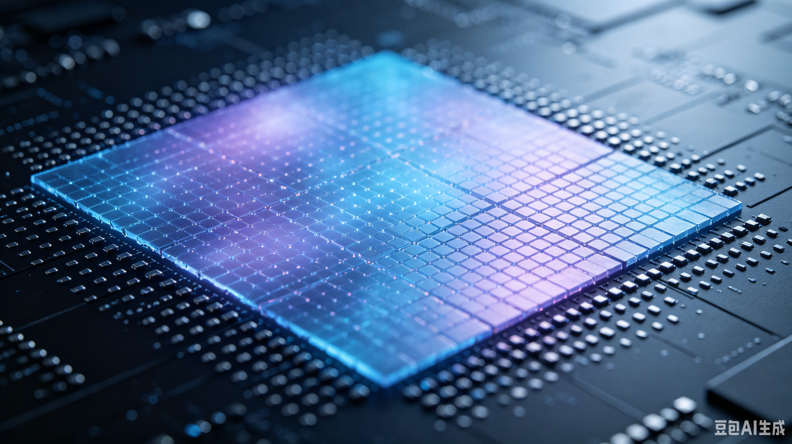

13.5nm的謎思---光蝕刻 天 -原分子大小

這個長度，就是因半導體製程而來，因為他站在技術的最前沿。但需要這麼短嗎？

物理有一個特別名詞，叫 **近場**，而其意義是，某個特質接近時，原來的的特性是否會隨之改變，而這些特性的數量，亦有可能減少或增多。

而現在半導體的製程，已積累了半個世紀，也快到了此製程的近場領域了---原分子的尺吋,原子的直徑 - He-0.1, O-0.13, H-0.15, Ar-0.18, C-0.18,Si-0.29, Fe-0.34nm；所以1nm，Si只能排三顆，10nm是33顆，28nm96䫡。

另一個是SiO2 <0.29+2*0.13=0.55, 所以應是0.4nm附近

而製程中，另一個是光阻劑，他是分子，如是有機的，會更大顆，基本上直徑，應有1nm上下，所以28nm，就28顆光阻劑分子

就光看這三個尺吋，光阻劑才是製程的卡點；所以廠商若想再縮小光阻劑的分子尺吋，就需用更少的原子來組成，而這就是無機光阻劑的想法。

所以nm基本上就是原分子的近場學了，這近場是非常case by case，且尺吋是和數量是非常關鍵的。巨觀的規律，在此會有大變動。近場以學術而言，是為抓規則，但以工業而言，可跳過科學的目的，進而找一特別路徑而符其所需即可；根本的目的是完全不同。

而28nm是成熟製程的光學極限，但實際的線寬應是還沒無達到；而EUV曝光機，雖可過此限，但又到近場領域，未知變數過多；且另一個大問題是，光阻劑的分子大小反而是製程的瓶頸，而且是物理極限---這是鐵律，人力無法克服。

所以半導體製程-光蝕刻-的限制，如用到EUV，那就是光阻劑了，且整體離物理限制亦不遠了。