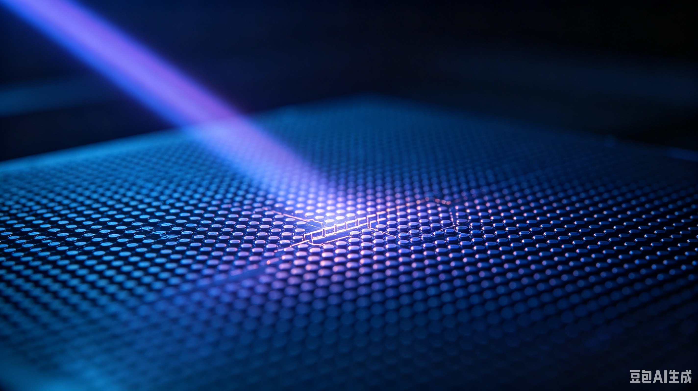

13.5nm的迷思---光源

其實要產生光，方法就那幾個：這是較常用
- 熱生光：黑體輻射，多是固態
- 原分子能階生光---多為氣態
  - glow
  - arc
  - microwave
- LED：半導體

而Sn的13.5nm應是原子能階型的，且類似microwave, 只是他是用 CO2 laser的電磁波，而不是微波---波段不同。

而上面的方式，有一大缺點，波長是被原分子所限制---黑體除外。但還有一種非常特別，那就是同步輻射，它可產幾乎是全波段的光IR到X-ray；但，它可不是一個便宜的裝置，算是世上最貴的光源產生器。

而同步中，有一個特別的裝置-undulator-周期性線性排列的磁鐵，台灣稱之聚頻磁鐵（大陸-波盪器）。出光的強度與其總長度成正比；當然與粒子束帶的總電荷也成正比。

所以用聚頻磁鐵的方式，可達到選光和增光強的特性，所以波長隨意選。但能用於半導體工業嗎？或許可行，但所有東西是一整套，而不是單看其一的極限。

若是用同步，整的光路會較像DUV，因其光源出來後，準直性較高，不像ASML的LPP是擴散型的光，所以鏡子用量會減少，所以光強衰澸度會降低不少，這可能補足同步與LPP的光強差的方式之一。

而化學反應是吸一個光子，反應一次，所以，這就要看光子數了，同能量強度，但波長長三倍，那光子數，就比短波長的多三倍，反應效果就提升三倍，所以再考量上一篇的製成限制---光阻的分子大小，13.5nm的必要性，其實沒那麼高若用50nm的光，其光子量就比13.5nm的多50/13.5 倍了，這也是曝光時間的關鍵考量之一。

當然鏡子的吸收率，也是絕對必要的考量之一；而若是光波長不是一個限制項，其他撘配，就相對好調試或是好找。

所以整個製程是一整套，其中一環節未通，就不能用。所以系統要的是整體調節最好，而不是追求單一元件的極限。所以當少了波長的選擇限制後，其他撘配難度定會大輻降低。

所以整體而言，光阻的光化性，應是最重要的考量。

#半導體 #極紫光微影 #EUV #ASML #同步輻射 #Synchrotron #Semiconductor #Photolithography #晶圓代工 #光阻 #Photolith #光學系統 #先進製程 #半導體物理 #系統工程 #DeepTech

#半导体 #EUV光刻机 #光刻技术 #ASML #同步辐射 #光刻胶 #光子 #光学物理 #芯片制造 #先进封装与制程 #系统工程 #黑体辐射 #波荡器