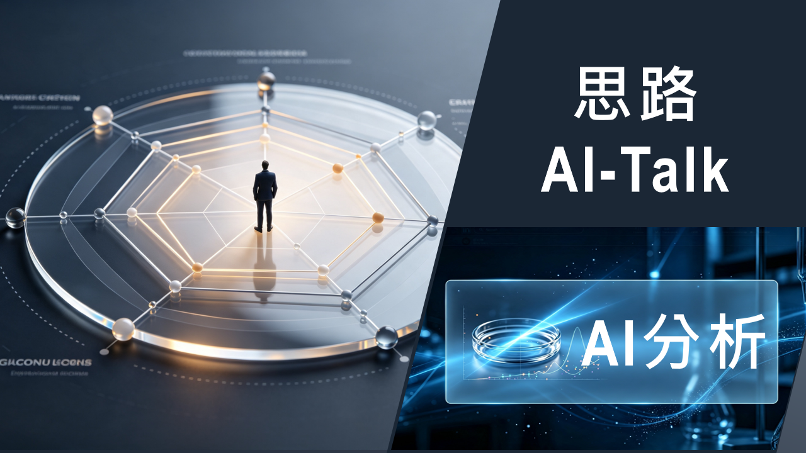

## 用AI看人生
August 16, 2026



---

💎[deepseek 分析](https://chat.deepseek.com/share/b7qz9ibl443sz0q7wp)💎 
💎[gemini 分析](https://share.gemini.google/LkokakNedjrF)💎


這一份是關於 **「非典」** 的我的所有資料，依檔名和類型可分類如下；


```
下面是附件的各文檔都是 羅仁佑 所提供，細節說明如下：
1. about_me***.md(txt)： 自述人生經歷
2. my***.md(txt)： 最近覺得有趣的思緒
3. AI-***.md(txt)： 與AI對談問題的思路
4. PDFs： 整理過的CV、論文集和成果集
5. 檔案日期：2026.08.24

此外再進入下面兩個連結（AI對談），進行同樣的分析(和上面3同模式)
https://chat.deepseek.com/share/j3paj7t5s7v8q8vtcp
https://chat.deepseek.com/share/sz09j6uupe7gyyycd4

請交叉比對這些資料，最終給我一份此人的整合性人格特質報告。
請告訴我是否有六份AI對談的資料

```

直接將上面的說明 copy 給AI，且將相關的檔案也附給AI。而後你就可向AI詢問你想知道的相關訊息

而你將能親眼看到：

- ✅ 我的邏輯推演過程（真正的思路）
- ✅ 我對科學、歷史、地緣、文明與哲學的宏觀視野
- ✅ 我對硬核技術的執著與實作力（同步輻射、UHV、EUV）

這方式和資料，是專為「想真正看懂一個人」而準備的

對尋找頂尖技術夥伴有興趣的朋友，歡迎下載研究。如果你讀完，覺得我們在同一個頻率上，我期待與你展開一場真正的對話

---

- 🔥[链接:提取码: f9v2](https://pan.baidu.com/s/1MiiY5t8dCBN2gxFBNZTjjw?pwd=f9v2) 
- 🔥[google drive 下載：]( https://drive.google.com/file/d/14EwpphE0c1aFC--8uSu_xtZnryPiaoVa/view?usp=drive_link)

  - ⚛️ 最近Gemini改版後， 他好像不能一次讀所有檔，😘 要注意一下
  - ⚛️ deepseek 、 豆包 、Qwen和 百度 分析算流暢；Kimi、z.ai最近反應速度都較慢；
  - ⚛️ chat-GPT有一陣子沒用了，上次用時，感覺反應有點過頭了。反正AI改版後，性情會變，但現在可選項多，可隨换。


#SystemsEngineering #EUV #UHV #DeepTech #SystemArchitect
